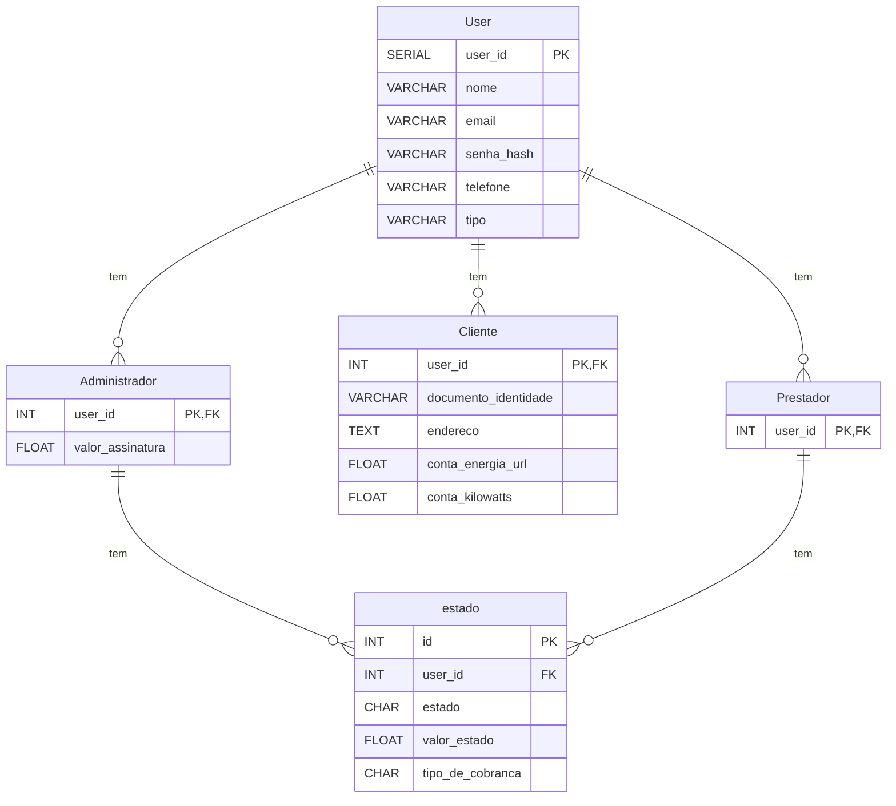

# Diagrama ER

```mermaid
    erDiagram
        User {
            SERIAL user_id PK
            VARCHAR nome
            VARCHAR email
            VARCHAR senha_hash
            VARCHAR telefone
            VARCHAR tipo
        }

        Administrador {
            INT user_id PK, FK
            FLOAT valor_assinatura
        }

        Cliente {
            INT user_id PK, FK
            VARCHAR documento_identidade
            TEXT endereco
            FLOAT conta_energia_url
            FLOAT conta_kilowatts
        }

        Prestador {
            INT user_id PK, FK
        }

        estado {
            INT id PK
            INT user_id FK
            CHAR estado
            FLOAT valor_estado
            CHAR tipo_de_cobranca
        }

    User ||--o{ Cliente : "tem"
    User ||--o{ Prestador : "tem"
    User ||--o{ Administrador : "tem"
    Administrador ||--o{ estado : "tem"
    Prestador ||--o{ estado : "tem"
```